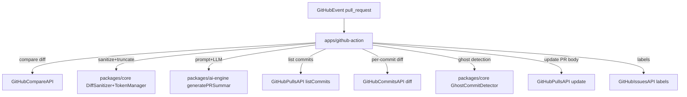

# Architecture

`lazypr` is a Bun monorepo with a GitHub Action entrypoint bundled for Node.js.

## Packages

- `apps/github-action`: GitHub Action entrypoint (reads inputs, calls GitHub APIs, updates PR)
- `packages/core`: diff fetching helpers, diff sanitization, token truncation, ghost commit detector
- `packages/ai-engine`: LLM orchestration, impact scoring, checklist generation
- `packages/config-presets`: built-in prompt presets

## Runtime flow

## Notes

- **Diff sanitization**: lockfiles and non-code assets are filtered out before sending to the LLM.
- **Token truncation**: high-risk files are prioritized when truncating to provider context limits.
- **Impact scoring**: based on file path pattern matching to produce an impact score (0–100) and risk level.
- **Ghost commits**: compares commit message keywords to the commit’s diff. Limited to the most recent 20 commits.
